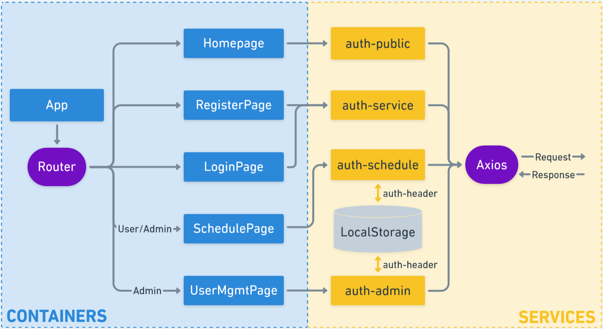

# Flight Movement App (Front-end)

`Live:` https://devchia254-fma-v1.herokuapp.com/


This web app is designed to be an online Flight Display Information System like at airports. It is a dashboard that provides general information on monitoring flight statuses of the day. The dashboard also shows weather information and additional information such as Flight Safety.

As a system, users can be registered to be granted permission to schedule flights. It also displays the weather forecast based on three locations and important information such as Flight Safety.

This is the source code of the **Front-end**.
To see the Back-end, [**click here**](https://github.com/devchia254/facedetection-api).

## Info

- Flights only show a 6-day coverage (Today +-3days)
- Since this is meant to be a dashboard displayed on a large TV for people to observe, a carousel with a self-timer (20 secs) was implemented on the homepage to cater this experience.
- This Front-End was built using React.
- This Full-Stack App is hosted on Heroku using a Free and Hobby Plan (Since it is free expect a slight delay connecting to the server)
- It is Mobile Responsive.

## Purpose

- Build a Full-Stack CRUD application.
- Solidify my React knowledge and broaden my Full-Stack skills and technologies.
- Develop a project based on client requirements, with the consideration of security practices.

## Features

- User login and registration system that uses JWT Authentication
- JWT Authorisation stored in Local Storage and HTTP Requests handled by Axios.
- Project structured using React Router, with protected routes.
- Form Validation using Formik and Yup
- Components styled with Material-UI
- Dynamic Navigation Bar based on type of user (Public i.e. No User, User or Admin)
- Weather Forecast fetched from OpenWeatherMap API

## Project Structure

### Source folder Structure

#### Assets

Contains weather fonts and icons, homepage images, and custom theme.

#### Components

Contains either reusable components or components that do not belong to a specific page/route. Custom and protected routes are stored here.

#### Containers

The file structure is based on their routes and each file contain its main parent component and its respective child components. The parent components are stateful meaning they provide state, data, and actions to their child components via props, and also contain side effects.

#### Services

These services handles most of the HTTP requests to the backend, including Authentication and Authorisation.

### Project Flow: React Router, Axios & Local Storage



## NPM Dev Packages:

`react` , `react-dom` and `react-scripts`, were initiated from the create-react-app command.
`tachyons` is a package for styling the site with greater ease.

```json
"dependencies": {
    "react": "^16.8.6",
    "react-dom": "^16.8.6",
    "react-particles-js": "^2.6.0",
    "react-scripts": "3.0.1",
    "react-tilt": "^0.1.4",
    "tachyons": "^4.11.1"
}
```
